# Managing Linux Networks

1.  Page 9 - Section 1, Step 8 - showing the network interfaces that are
    attached to the *network-interface* instance.

> 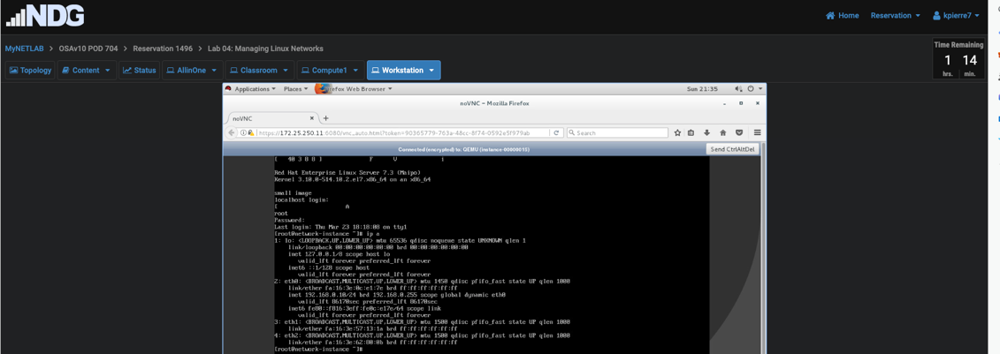

2.  Page 9 - Section 1, Step 9 - showing the network driver for
    the *eth0* interface.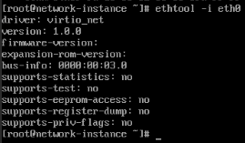

3.  Page 10 - Section 1, Step 12 - showing the IP address assigned to
    the *eth1* interface.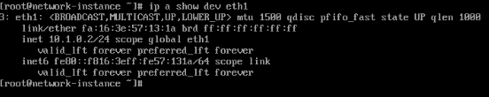

4.  Page 10 - Section 1, Step 13 - showing the results of the *ping* command.

> 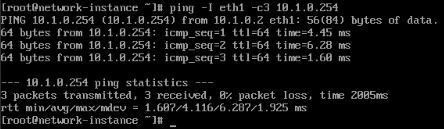

5.  Page 11 - Section 1, Step 14c - showing the packet information in
    the *tcpdump-eth1.txt* file.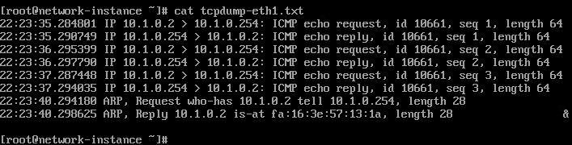

6.  Page 12 - Section 1, Step 15c - showing the IP address assigned to
    the *eth2* interface.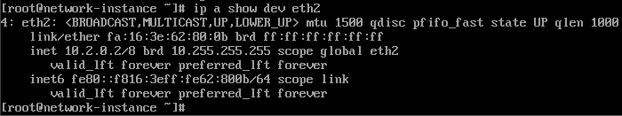

7.  Page 13 - Section 1, Step 16a - showing the results of
    the *ping* command.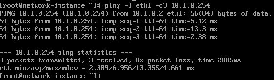

8.  Page 13 - Section 1, Step 17b - showing the IP address assigned to
    the *eth1* interface.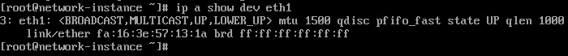

9.  Page 14 - Section 1, Step 17c - showing the IP address assigned to
    the *eth2* interface.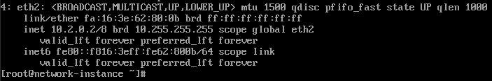

10. Page 19 - Section 2, Step 13 - showing the bridge
    information.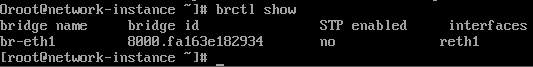

11. Page 19 - Section 2, Step 14 - showing the IP address of the
    bridge.brct1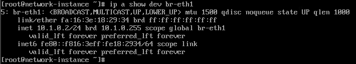

12. Page 20 - Section 2, Step 17 - showing the configuration of the
    bridge.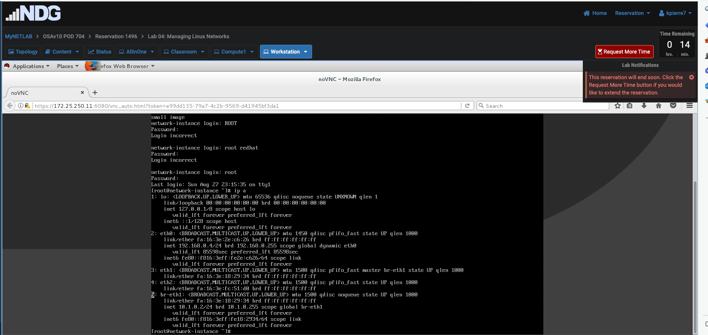

13. Page 27 - Section 3, Step 14 - showing the bridge
    configuration.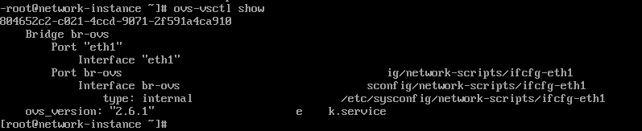

14. Page 27 - Section 3, Step 16 - showing the IP address of the
    bridge.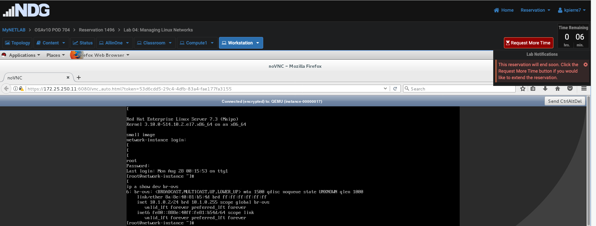

15. Page 27 - Section 3, Step 17 - showing the results of
    the *ping* command.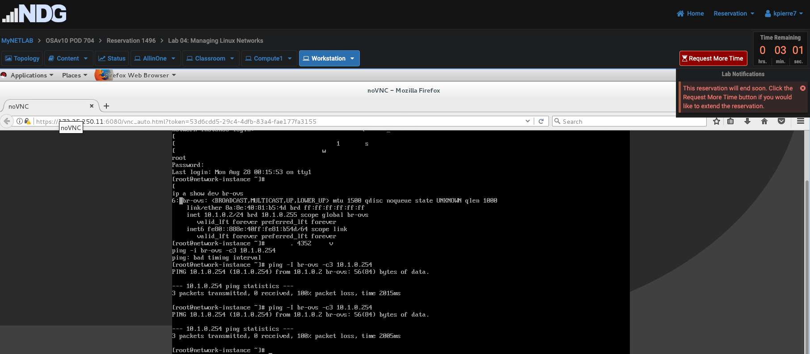
